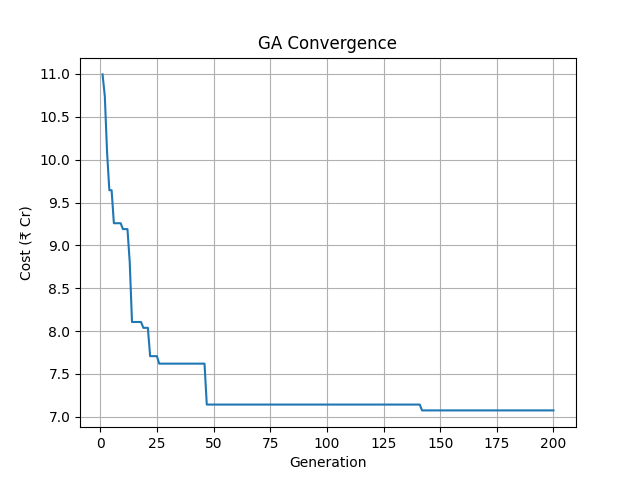
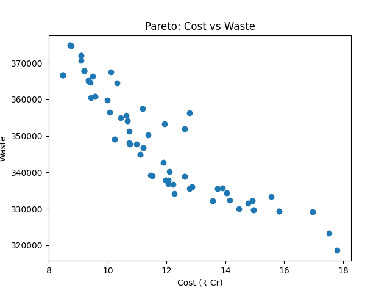
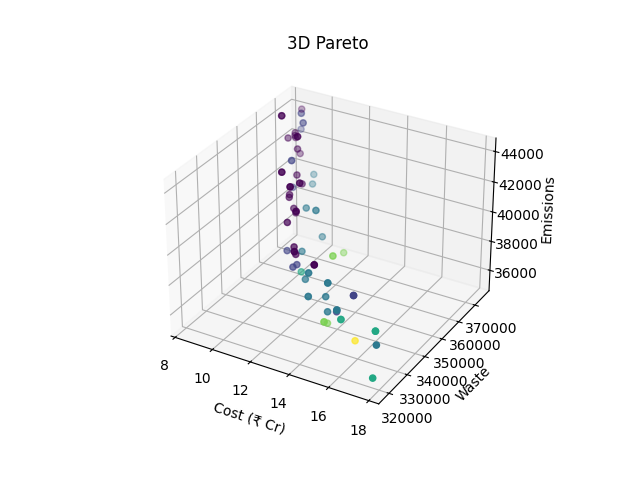
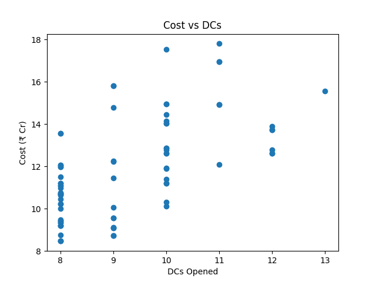
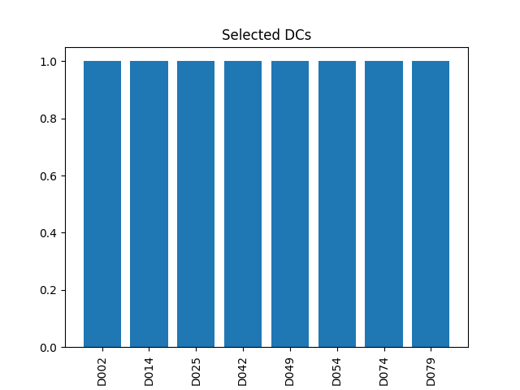

# 🇮🇳 India Vaccine Supply Chain Optimization

### (MILP + NSGA-II | Operations Research + AI)

🔬 Research-level project for optimizing large-scale vaccine supply chains using **exact optimization and evolutionary algorithms**

---

## 📌 Problem Statement

Design an efficient vaccine distribution system across India:

* Multi-tier network: Supplier → Distribution Center → Hospital
* Cold-chain constraints (temperature-sensitive vaccines)
* Trade-offs between cost, waste, and environmental impact

👉 Optimize simultaneously:

* 💰 Total Cost
* 🧊 Vaccine Waste
* 🌍 CO₂ Emissions

---

## 📊 Scale of the Model

* 🏭 15 Suppliers
* 🏢 100 Distribution Centers
* 🏥 500 Hospitals
* 🌐 **615 Nodes**
* 🔗 **51,500 Routes (Arcs)**

---

## 🧠 Methods Used

### 🔹 MILP (Exact Optimization)

* Solved using `scipy.milp` (HiGHS solver)
* Provides **provably optimal solutions** for smaller instances
* Uses sparse constraint modeling for efficiency

---

### 🔹 NSGA-II (Multi-objective Optimization)

* Optimizes:

  * Cost
  * Waste
  * Emissions
* Produces **Pareto-optimal solutions**

---

## 🔬 Research Contribution

This project combines **exact optimization (MILP)** and **metaheuristic algorithms (NSGA-II)**:

* MILP → optimal solutions (small/medium scale)
* LP relaxation → lower bound for full-scale problem
* NSGA-II → scalable near-optimal solutions

### 📊 Key Insight

* Exact methods do not scale to large networks
* Heuristic methods efficiently solve real-world scale problems
* Results validate solution quality against theoretical lower bounds

---

## 📈 Results

* 💰 Best Cost: ~₹7 Cr
* 📉 Significant waste reduction
* 🌍 CO₂ emissions optimized
* 🏢 Optimal DCs opened: ~8

---

## 📊 Visualizations

### 🔹 GA / NSGA Convergence



### 🔹 Pareto Front



### 🔹 3D Pareto



### 🔹 Cost vs DCs



### 🔹 Selected Distribution Centers



---

## ⚙️ Key Features

* ✅ Distance-based decay modeling
* ✅ Dynamic refrigeration decision
* ✅ Capacity constraints (strict)
* ✅ Multi-objective optimization
* ✅ Large-scale (615-node network)
* ✅ Realistic supply chain simulation

---

## 🧾 Project Structure

```
nsga2.py      → Multi-objective optimization  
milp.py       → Exact optimization model  
graphs/       → Visual outputs  
docs/         → Project report  
```

---

## ▶️ How to Run

```bash
pip install -r requirements.txt
python nsga2.py
```

---

## 🧪 Technologies Used

* Python
* NumPy, Pandas
* SciPy (MILP solver)
* Evolutionary Algorithms
* Matplotlib

---

## 🎯 Why This Project Matters

* Real-world logistics optimization
* Applicable to:

  * Vaccine distribution
  * E-commerce supply chain
  * Sustainable logistics

👉 Demonstrates:

* Optimization modelling
* Algorithm design
* Research-level thinking

---

## 👨‍💻 Author

**Safal Pathak**
Mechanical Engineering + AIML Minor
Optimization & AI Enthusiast

---

## ⭐ If you like this project, give it a star!
